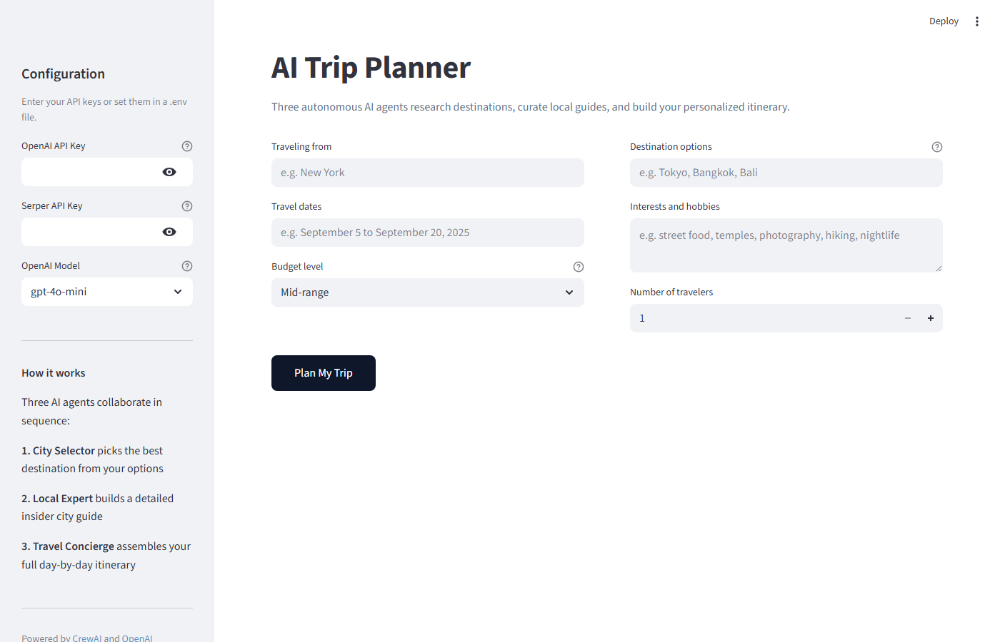
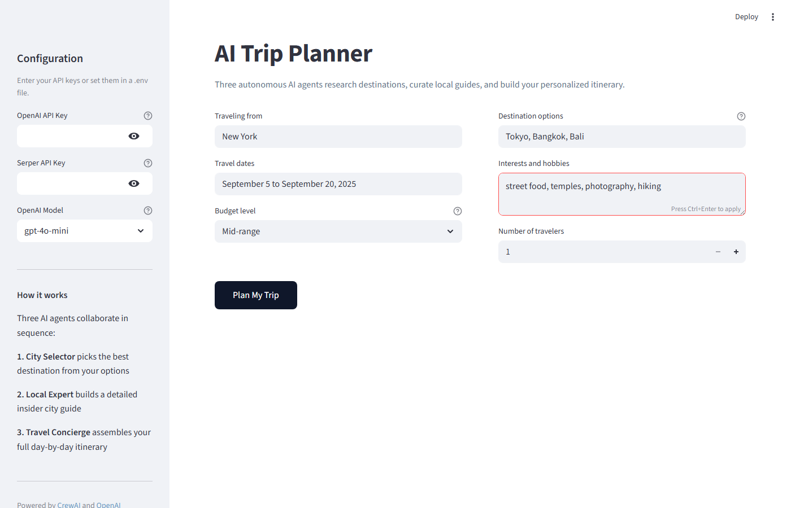
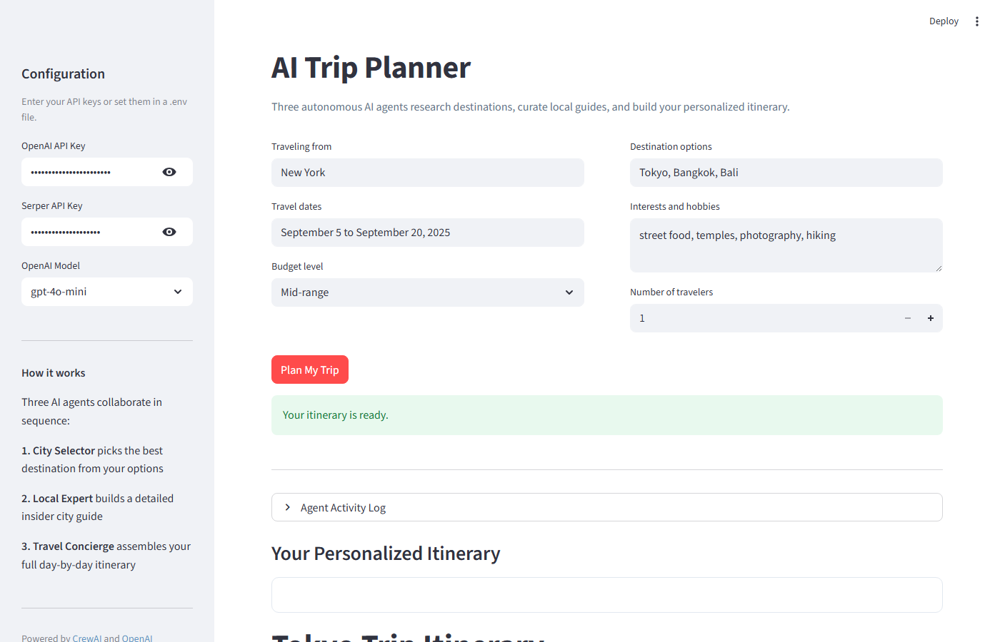
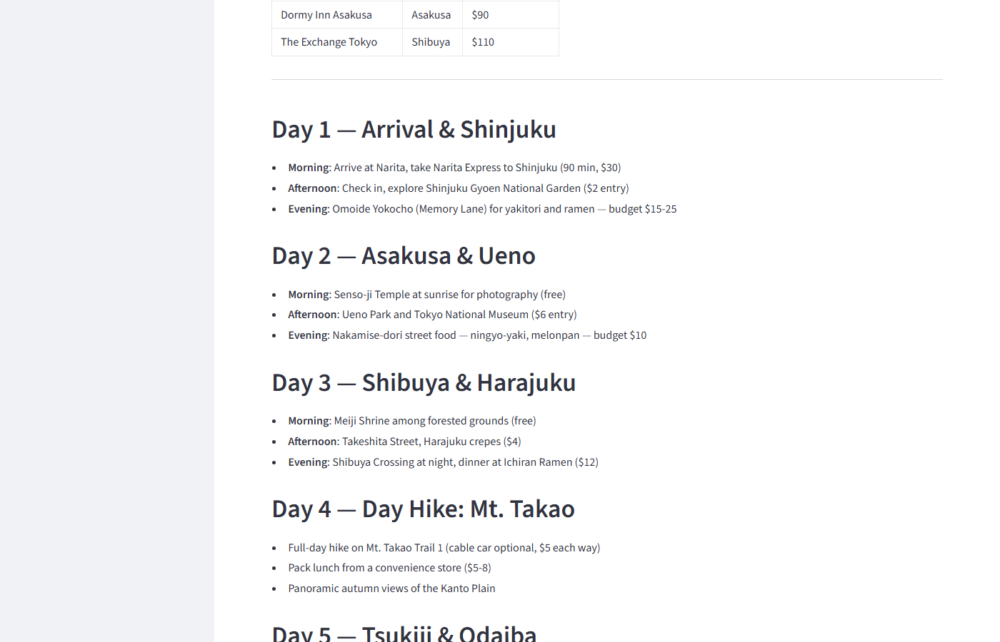
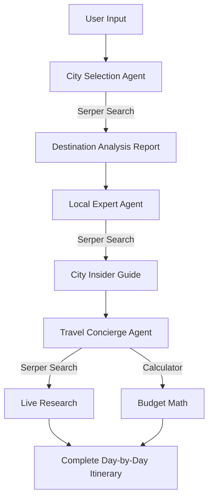

# AI Trip Planner

> Autonomous AI travel planning with a full web interface, powered by CrewAI and GPT-4

[](https://python.org)
[](https://crewai.com)
[](https://streamlit.io)
[](https://openai.com)
[](LICENSE)

AI Trip Planner orchestrates three specialized AI agents to research destinations, compile local insider guides, and generate complete day-by-day travel itineraries. Enter your travel preferences and receive a fully personalized plan with hotel picks, restaurant recommendations, a packing list, and a detailed budget breakdown.

## Screenshots

| Landing Page | Form Filled |
|:---:|:---:|
|  |  |

| Results View | Day-by-Day Itinerary |
|:---:|:---:|
|  |  |

## Features

| Feature | Description |
|---------|-------------|
| Multi-agent planning | City Selector, Local Expert, and Travel Concierge collaborate sequentially |
| Real-time web search | Agents query live travel data, prices, and events via Serper API |
| Budget-aware itineraries | Tailored plans for Budget, Mid-range, and Luxury travelers |
| Group travel support | Adjusts costs and recommendations for any number of travelers |
| Streamlit web UI | Clean browser-based interface with sidebar API configuration |
| CLI mode | Full command-line interface for terminal users |
| Downloadable plans | Export your itinerary as a Markdown file |

## Architecture



## Project Structure

```
.
├── src/
│   ├── agents.py          # Three specialized CrewAI agents
│   ├── tasks.py           # Task definitions with expected outputs
│   ├── crew.py            # TripCrew orchestrator
│   └── tools/
│       ├── search.py      # Serper web search tool
│       └── calculator.py  # Safe arithmetic evaluation tool
├── app.py                 # Streamlit web interface
├── cli.py                 # Command-line interface
├── .env.example           # Environment variable template
└── requirements.txt
```

## Overview

This project comprises several Python modules:

- **crewai**: Core framework for managing the trip planning agent crew with sequential task execution.
- **src/agents**: Specialized agents for city selection, local expertise, and travel concierge services.
- **src/tasks**: Task definitions for destination analysis, city research, and itinerary creation.
- **langchain**: Integration with language models via `langchain-openai`, supporting OpenAI GPT models.

## Getting Started

### Prerequisites

- Python 3.10 or higher
- [OpenAI API key](https://platform.openai.com/api-keys)
- [Serper API key](https://serper.dev) (free tier available, 2 500 free queries/month)

### Installation

```bash
git clone https://github.com/punyamodi/AI-Trip-Planner-using-CrewAI.git
cd AI-Trip-Planner-using-CrewAI

python -m venv venv
# Windows
venv\Scripts\activate
# macOS / Linux
source venv/bin/activate

pip install -r requirements.txt
```

### Configuration

Copy the example environment file and add your API keys:

```bash
cp .env.example .env
```

Edit `.env`:

```env
OPENAI_API_KEY=your_openai_api_key
SERPER_API_KEY=your_serper_api_key
OPENAI_MODEL=gpt-4o-mini
```

API keys can also be entered directly in the Streamlit sidebar without creating a `.env` file.

## Usage

### Web Interface

```bash
streamlit run app.py
```

Open [http://localhost:8501](http://localhost:8501) in your browser. Fill in your trip details and click **Plan My Trip**.

### Command Line

```bash
python cli.py
```

Follow the prompts. The completed itinerary is printed to the terminal and saved as `trip_itinerary.md`.

### Programmatic

```python
from src.crew import TripCrew

crew = TripCrew(
    origin="New York",
    destinations="Tokyo, Bangkok, Bali",
    date_range="September 5 to September 20, 2025",
    interests="street food, temples, photography, hiking",
    budget="Mid-range",
    travelers=2,
)

result = crew.run()
print(result)
```

## Agent Workflow

| Agent | Responsibility | Tools |
|-------|---------------|-------|
| City Selection Expert | Picks the best destination by comparing weather, events, and flight costs | Web Search |
| Local Expert | Compiles a detailed insider guide: attractions, neighborhoods, food, culture | Web Search |
| Travel Concierge | Builds the full itinerary with hotels, restaurants, budget, and packing list | Web Search, Calculator |

## Example Input

| Field | Example Value |
|-------|--------------|
| Traveling from | New York |
| Destinations | Tokyo, Bangkok, Bali |
| Travel dates | September 5 to September 20, 2025 |
| Interests | Street food, temples, photography, nature |
| Budget | Mid-range |
| Travelers | 2 |

## Configuration Reference

| Variable | Description | Default |
|----------|-------------|---------|
| `OPENAI_API_KEY` | OpenAI API key | Required |
| `SERPER_API_KEY` | Serper search API key | Required |
| `OPENAI_MODEL` | OpenAI model name | `gpt-4o-mini` |

## Contributing

Contributions are welcome. Open an issue or submit a pull request on GitHub.

## License

MIT License
